# imports


```python
import matplotlib.pyplot as plt
import numpy as np
import itertools
import os
import pandas as pd
import math
import mme_eval.multi_eval
import pandas
import numpy as np
import itertools
from matplotlib.pylab import plt
```

# Analyze dcase 2020 systems


```python

rootFolder='dcase2020'

dataset='public'
gtf=f'{rootFolder}/metadata/{dataset}.tsv'
metaf=f'{rootFolder}/metadata/{dataset}.meta.tsv'
groundtruth=pd.read_csv(gtf,delimiter='\t')

l=['Miyazaki_NU_task4_SED_1','Miyazaki_NU_task4_SED_3','Hao_CQU_task4_SED_4','Koh_NTHU_task4_SED_3','Liu_thinkit_task4_SED_3','Miyazaki_NU_task4_SED_2','Ebbers_UPB_task4_SED_1','Hao_CQU_task4_SED_2','CTK_NU_task4_SED_4','Yao_UESTC_task4_SED_3']
# l=['Ebbers_UPB_task4_SED_1']
total_dic={}
for team in sorted(os.listdir(f'{rootFolder}/submissions/')):
    for code in sorted(os.listdir(f'{rootFolder}/submissions/{team}')):
        if not(code in l):continue
        print(f'    {code}')
        
        base_prediction_path=f'{rootFolder}/submissions/{team}/{code}/{dataset}/'
        pef = f'{base_prediction_path}/{code}.output.tsv'
        if not(os.path.isfile(pef)):
            all=[x for x in os.listdir(base_prediction_path) if '.output.tsv' in x]
            if len(all)>0:
                pef=f'{base_prediction_path}/{all[0]}'
            else:
                print('error not found',pef)
                continue
        try:
            title=code.replace('_task4','')
            res1=mme_eval.multi_eval.get_single_result(gtf,pef,metaf,debug=0)
            total_dic[title]=res1
        except Exception as e:
            print('Error! submission is ignored',e)
#             raise
            
fs={s:{c:total_dic[s][c].loc['macro-avg']['f1'] for c in total_dic[s]} for s in total_dic  }
total=pd.DataFrame(fs).T
total
```

        CTK_NU_task4_SED_4
        Ebbers_UPB_task4_SED_1
        Hao_CQU_task4_SED_2
        Hao_CQU_task4_SED_4
        Koh_NTHU_task4_SED_3
        Liu_thinkit_task4_SED_3
        Miyazaki_NU_task4_SED_1
        Miyazaki_NU_task4_SED_2
        Miyazaki_NU_task4_SED_3
        Yao_UESTC_task4_SED_3


<div>
<style scoped>
    .dataframe tbody tr th:only-of-type {
        vertical-align: middle;
    }

    .dataframe tbody tr th {
        vertical-align: top;
    }

    .dataframe thead th {
        text-align: right;
    }
</style>
<table border="1" class="dataframe">
  <thead>
    <tr style="text-align: right;">
      <th></th>
      <th>collar</th>
      <th>segment</th>
      <th>psd d/gtc=0.1</th>
      <th>psd d/gtc=0.3</th>
      <th>psd d/gtc=0.5</th>
      <th>psd d/gtc=0.8</th>
      <th>psd d/gtc=0.85</th>
      <th>psd d/gtc=0.9</th>
      <th>detection</th>
      <th>detect-mono</th>
      <th>monotony</th>
      <th>uniformity</th>
      <th>total duration</th>
      <th>relative duration</th>
      <th>boundary onset</th>
      <th>boundary offset</th>
    </tr>
  </thead>
  <tbody>
    <tr>
      <th>CTK_NU_SED_4</th>
      <td>0.504686</td>
      <td>0.734447</td>
      <td>0.739508</td>
      <td>0.716928</td>
      <td>0.669434</td>
      <td>0.559581</td>
      <td>0.517729</td>
      <td>0.463445</td>
      <td>0.742460</td>
      <td>0.675633</td>
      <td>0.630011</td>
      <td>0.935575</td>
      <td>0.680940</td>
      <td>0.874490</td>
      <td>0.903049</td>
      <td>0.901298</td>
    </tr>
    <tr>
      <th>Ebbers_UPB_SED_1</th>
      <td>0.508973</td>
      <td>0.778014</td>
      <td>0.765865</td>
      <td>0.748280</td>
      <td>0.714474</td>
      <td>0.533983</td>
      <td>0.470317</td>
      <td>0.405464</td>
      <td>0.769607</td>
      <td>0.688082</td>
      <td>0.627385</td>
      <td>0.916364</td>
      <td>0.716073</td>
      <td>0.847792</td>
      <td>0.906158</td>
      <td>0.894404</td>
    </tr>
    <tr>
      <th>Hao_CQU_SED_2</th>
      <td>0.506343</td>
      <td>0.711678</td>
      <td>0.732883</td>
      <td>0.722288</td>
      <td>0.696792</td>
      <td>0.532276</td>
      <td>0.473409</td>
      <td>0.411079</td>
      <td>0.733464</td>
      <td>0.684312</td>
      <td>0.622953</td>
      <td>0.940537</td>
      <td>0.696411</td>
      <td>0.871267</td>
      <td>0.917285</td>
      <td>0.902296</td>
    </tr>
    <tr>
      <th>Hao_CQU_SED_4</th>
      <td>0.523201</td>
      <td>0.701758</td>
      <td>0.717141</td>
      <td>0.709073</td>
      <td>0.689820</td>
      <td>0.557636</td>
      <td>0.514738</td>
      <td>0.456140</td>
      <td>0.717943</td>
      <td>0.676362</td>
      <td>0.628956</td>
      <td>0.953646</td>
      <td>0.687413</td>
      <td>0.906078</td>
      <td>0.932241</td>
      <td>0.916433</td>
    </tr>
    <tr>
      <th>Koh_NTHU_SED_3</th>
      <td>0.515043</td>
      <td>0.761354</td>
      <td>0.743417</td>
      <td>0.728392</td>
      <td>0.706002</td>
      <td>0.580205</td>
      <td>0.537492</td>
      <td>0.469844</td>
      <td>0.743899</td>
      <td>0.689416</td>
      <td>0.615224</td>
      <td>0.923053</td>
      <td>0.723627</td>
      <td>0.890866</td>
      <td>0.923456</td>
      <td>0.911290</td>
    </tr>
    <tr>
      <th>Liu_thinkit_SED_3</th>
      <td>0.511941</td>
      <td>0.735136</td>
      <td>0.725679</td>
      <td>0.716419</td>
      <td>0.681250</td>
      <td>0.566150</td>
      <td>0.524448</td>
      <td>0.455780</td>
      <td>0.726459</td>
      <td>0.677897</td>
      <td>0.626754</td>
      <td>0.945809</td>
      <td>0.700073</td>
      <td>0.908391</td>
      <td>0.928400</td>
      <td>0.906258</td>
    </tr>
    <tr>
      <th>Miyazaki_NU_SED_1</th>
      <td>0.556713</td>
      <td>0.775097</td>
      <td>0.774237</td>
      <td>0.754398</td>
      <td>0.730325</td>
      <td>0.591954</td>
      <td>0.536406</td>
      <td>0.450517</td>
      <td>0.776046</td>
      <td>0.729395</td>
      <td>0.671238</td>
      <td>0.943554</td>
      <td>0.732932</td>
      <td>0.877952</td>
      <td>0.933467</td>
      <td>0.920208</td>
    </tr>
    <tr>
      <th>Miyazaki_NU_SED_2</th>
      <td>0.510778</td>
      <td>0.764084</td>
      <td>0.751012</td>
      <td>0.733949</td>
      <td>0.706676</td>
      <td>0.541507</td>
      <td>0.484888</td>
      <td>0.404188</td>
      <td>0.752869</td>
      <td>0.710701</td>
      <td>0.647608</td>
      <td>0.941757</td>
      <td>0.717381</td>
      <td>0.856371</td>
      <td>0.928592</td>
      <td>0.913680</td>
    </tr>
    <tr>
      <th>Miyazaki_NU_SED_3</th>
      <td>0.551983</td>
      <td>0.772585</td>
      <td>0.763047</td>
      <td>0.747109</td>
      <td>0.724789</td>
      <td>0.578939</td>
      <td>0.523205</td>
      <td>0.437524</td>
      <td>0.766416</td>
      <td>0.722035</td>
      <td>0.663496</td>
      <td>0.944729</td>
      <td>0.728691</td>
      <td>0.869855</td>
      <td>0.934516</td>
      <td>0.922230</td>
    </tr>
    <tr>
      <th>Yao_UESTC_SED_3</th>
      <td>0.505015</td>
      <td>0.774457</td>
      <td>0.768551</td>
      <td>0.763979</td>
      <td>0.738929</td>
      <td>0.525940</td>
      <td>0.459492</td>
      <td>0.386512</td>
      <td>0.770647</td>
      <td>0.713357</td>
      <td>0.617578</td>
      <td>0.920842</td>
      <td>0.733362</td>
      <td>0.892427</td>
      <td>0.900445</td>
      <td>0.871187</td>
    </tr>
  </tbody>
</table>
</div>


# Visualize Globally by F1


```python
w={'detection':1.,
   'uniformity':1.,
   'total duration':1.,
   'relative duration':1.,
#     'boundary onset':1.
}
wsum=sum(w.values())
total['our']=0
for wi in w:total['our']+=w[wi]/wsum*total[wi]

total=total.sort_values(['collar'])
# total=total[-10:]#displays top 10 systems
fig, axs = plt.subplots(1, 2, figsize=(8, len(total)/3), sharey=True)

ind = np.arange(len(total))
def myplot(ax,colis):
    cols=total.columns[colis]
    width = .9/len(cols)
    marker = itertools.cycle(( '^', 'o', 'D', 's','X', '*'))
    i=0
    ax.grid(True)

    for i,x in enumerate(cols):
        if x=='y':continue
#             ax.plot(total[x],ind+.2 ,label=x,marker=next(marker),alpha=.75)
        ax.scatter(total[x],ind+.2 ,label=x,marker=next(marker),alpha=.75)
#         ax.barh(ind+.4-i*width, total[x], width, label=x)#, color='red'

    ax.set(yticks=ind + width, yticklabels=[f'S{len(total)-i} : {y.replace("_SED","")}' for i,y in enumerate(total.index)], ylim=[-.5, len(total)-.5])
    ax.legend(loc='upper center', bbox_to_anchor=(0.5, -0.25),fancybox=True, shadow=True, ncol=2)
    ax.set_xlabel('F1')


myplot(axs[0],[0,1,len(total.columns)-1,2,4,5])
# myplot(axs[1],[2])
#     myplot(axs[1],range(len(total.columns)-9,len(total.columns)-1))
#     myplot(axs[1],[8,11,12,13])
myplot(axs[1],[8,11,12,13,14])

fig.tight_layout()
plt.show()
```


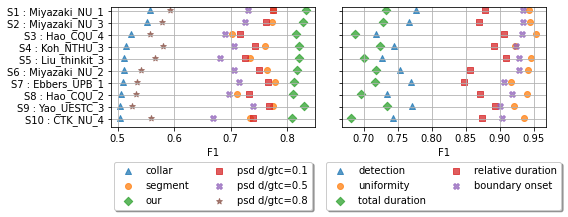


# Visualize in details


```python
for s in total_dic:
# for s in ['Miyazaki_NU_SED_1','CTK_NU_SED_4','Hao_CQU_SED_4']:
    print(s)
#     metrics=[m for m in total_dic[s]]
    metrics=['collar','psd d/gtc=0.8','psd d/gtc=0.5','psd d/gtc=0.1','detection','segment','total duration','uniformity','relative duration']
    metric_team={m:total_dic[s][m] for m in metrics }

#     metrics=list(team.keys())
    clas=[c for c in metric_team[metrics[0]].index[:-2]]
#     clas=['Dishes',  'Cat', 'Speech', 'Blender','Alarm_bell_ringing']

    team={c:pd.DataFrame({m: metric_team[m].loc[c] for m in metrics}).T for c in clas}
    
    removerows=['micro-avg','macro-avg']#,'Alarm_bell_ringing','Blender']
    
#     total=total[-10:]
    fig, axs = plt.subplots(1, len(clas), figsize=(len(clas), len(team[clas[0]])/5), sharey=True)
    

    gt = pd.read_csv(gtf, sep="\t")
    gt['duration']=gt.offset-gt.onset
    info=gt.groupby('event_label')['duration'].agg(['mean','std','count'])
    info=info.loc[clas]
    maxd=(info['mean']+info['std']).max().max();
    gt['duration']=maxd
    info_n=info/maxd

    avg_e_dur=pd.Series({c:team[c].loc['total duration'][['Ntp','Nfn']].sum()/team[c].loc['detection'][['Ntp','Nfn']].sum() for c in clas})
    avg_e_dur=pd.Series({c:team[c].loc['total duration'][['Ntp','Nfn']].sum()/team[c].loc['detection'][['Ntp','Nfn']].sum() for c in clas})
    e_count=pd.Series({c:team[c].loc['detection'][['Ntp','Nfn']].sum() for c in clas})
    

    avg_e_dur=avg_e_dur/avg_e_dur.max()
    e_count=e_count/e_count.max()
    
    ind = np.arange(len(team[clas[0]]))
    def myplot(ax,num,c):
        
        team_m=team[c][['Ntp','Nfn','Nfp']]#.iloc[[0,6,8,2,1,12,10,11,9,13,14,15]]
        
#         team_m=team_m.sort_index()
        ind = np.arange(len(team_m))
        cols=team_m
        team_m=(team_m.T/team_m.sum(axis=1)).T
        width = .8
        marker = itertools.cycle(( '^', 'o', 'D', 's','X', '*'))
        i=0

        ax.barh(ind+.8, team_m['Ntp'], width, label='TP',color='g')#, color='red'
        ax.barh(ind+.8, team_m['Nfn'], width,left=team_m['Ntp'], label='FN',color='#f6ff00',alpha=.25)#, color='red'
        ax.barh(ind+.8, team_m['Nfp'], width,left=team_m[['Ntp','Nfn']].sum(axis=1), label='FP',color='r',alpha=1)#, color='red'
        
        
        ax.barh(-.2,e_count[c],width,label='Count')
#         ax.barh(-1,avg_e_dur[c],width,label='Duration(avg)')
        ax.barh(-1,info_n.loc[c]['mean'],width,label='Duration (std)')
        ax.errorbar( info_n.loc[c]['mean'],-1.1, xerr=info_n.loc[c]['std'],color='black',elinewidth=1, fmt='-.')
        all_data=gt['duration'][gt['event_label']==c]
        
        ax.set(yticks=ind + width, yticklabels=[f'{y}' for i,y in enumerate(team_m.index)], ylim=[0.4-2, len(team_m)+.2],xlim=[0,1])
        if num==2:
            ax.legend(loc='upper center', bbox_to_anchor=(0, -0.45),fancybox=True, shadow=True, ncol=5)
        ax.set_xlabel(c.replace(' ','\n').replace('bell_','').replace('_','\n'))
        

#         ax.set_xticks(np.arange(0, 1, .5))
        ax.set_xticks(np.arange(0, 1, .25), minor=True)

        ax.grid(True,axis='x',which='both')

    for i,c in enumerate(clas):
        
        myplot(axs[i],i,c)
#     myplot(axs[1],range(len(total.columns)-8,len(total.columns)-1))
    
    # print(total)
    plt.show()


```

    CTK_NU_SED_4


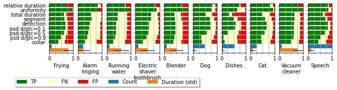


    Ebbers_UPB_SED_1


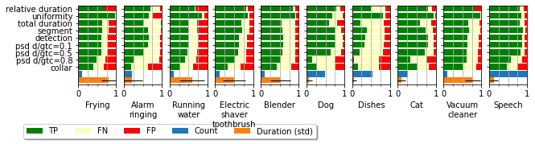


    Hao_CQU_SED_2


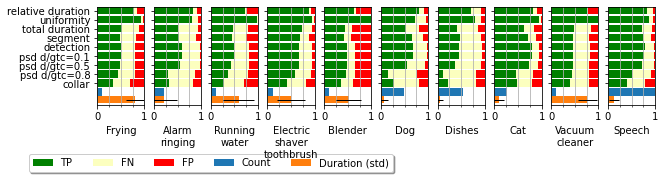


    Hao_CQU_SED_4


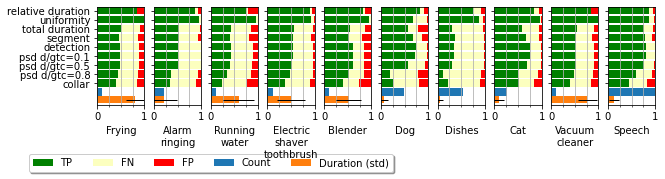


    Koh_NTHU_SED_3


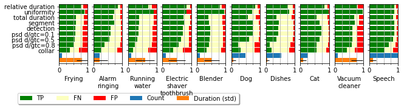


    Liu_thinkit_SED_3


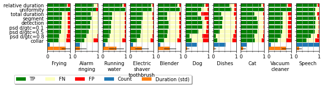


    Miyazaki_NU_SED_1


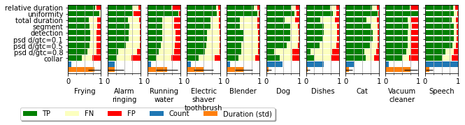


    Miyazaki_NU_SED_2


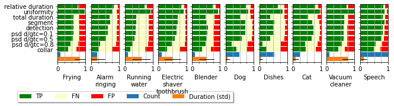


    Miyazaki_NU_SED_3


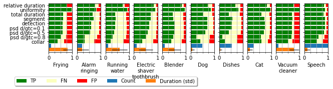


    Yao_UESTC_SED_3


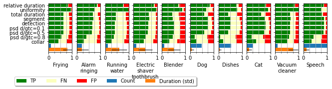

